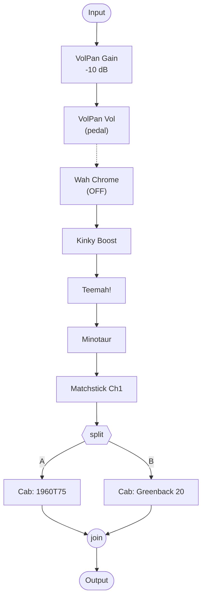
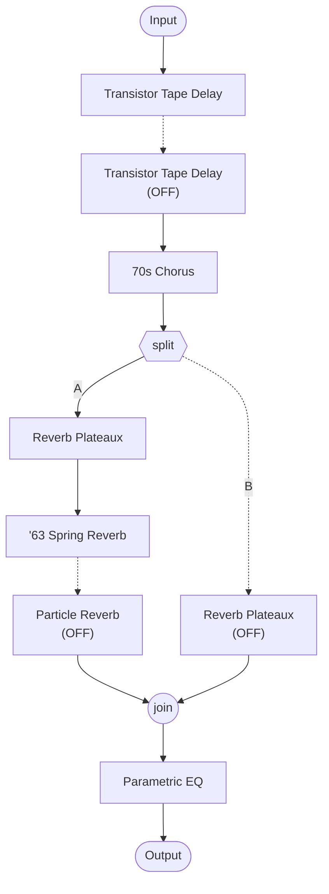

# Matchless (v3) — signal flow

Mermaid diagrams of the two DSP paths in `Matchless (v3).hlx`, generated by
reading `@position`/`@path`/`@enabled` on each block. Dashed lines mark a
block that's bypassed (OFF) but still routed inline, passing signal through
unaffected.

**Status:** dsp0 (Path 1) topology is straightforward — a single chain that
splits into two parallel cabs post-amp and rejoins. dsp1 (Path 2) is
unverified against the actual HX Edit routing — see the open question in
`glossary/models.md` about `@path`/`@position` semantics on split/join
blocks.

## Path 1 (dsp0)

## Path 2 (dsp1)

## Why this tone works — contemporary worship

*Written in the house voice — see "Writing tone write-ups" in the README.
Blends confirmed parameter values with general knowledge of these
amp/pedal models and genre conventions; treat the interpretive claims as
informed reading, not confirmed fact.*

Here's the read on this one: it's built to disappear into a mix, not fight
for space in it.

The amp (`HD2_AmpMatchstickCh1`) is Helix's take on a Matchless DC-30 —
boutique British-voiced clean amp, big headroom, that 3-dimensional
"chime" people chase. It stays clear and articulate even buried under a
pile of effects, which is why it shows up so often in modern worship/CCM
rigs instead of turning to mud the way a hotter amp would.

- **Gain trim then volume pedal, right at the front** — `HD2_VolPanGain`
  (-10 dB) into `HD2_VolPanVol`, both before all three drive pedals. That's
  not an accident: put the volume pedal ahead of the drive stack and it
  controls the whole downstream signal, drive included. That's what makes
  a proper worship-style swell work — you're fading in an already-driven
  tone, not just a clean one.
- **Three drives stacked light, not one pedal doing all the work** — Kinky
  Boost at `Drive: 0.3`, Teemah! at `Gain: 0.25`, Minotaur at `Gain: 0.81`,
  in series. Stack them mild like this and you build harmonic complexity
  gradually, nudging a clean amp toward the edge of breakup instead of
  slamming it with one hard-clipping stage. That's the difference between
  "clean-ish but alive" and a flat crunch tone.
- **Two cabs blended after the amp** — split into a 1960T75 (Celestion
  G12T-75) and a Greenback 20, balanced 50/50. Blending two cab voicings
  widens and smooths the frequency response — more three-dimensional than
  one mic'd cab, and it suits a tone that's meant to fill space rather
  than cut through a dense arrangement.
- **The second path is almost pure ambience** — tempo-synced tape delay,
  70s chorus, then a parallel blend of `HD2_ReverbPlateaux` (pitch-shifted
  voices layered into the tail, shimmer-style) and a '63-style spring
  reverb, closed out with a parametric EQ. This is the pad layer — the
  wide, sustained wash that lets one guitar occupy a lot of sonic real
  estate, which is exactly what you need sitting next to keys, pads, and
  vocals.

### Guitar & pickups

Passive single-coils or P90s are the natural fit — this amp's whole
appeal is headroom and clarity, and single-coils let that come through
instead of pushing the front end into breakup the way a hotter humbucker
would. Active pickups would work against the point of the patch; they're
voiced for a more compressed, higher-gain sound than anything happening
in this chain. Playing a humbucker-loaded guitar through this isn't a
problem — just roll the guitar's volume back a bit going in, and you'll
get closer to the single-coil-ish clarity the tone is built around.

Net effect: a clear, chimey clean-to-edge-of-breakup base, a volume pedal
positioned so swells actually work, and a heavily ambient second path for
atmosphere — built to sit underneath and around a mix, the opposite goal
from the Tribute tone (`Randy_Tribute.flow.md`).
