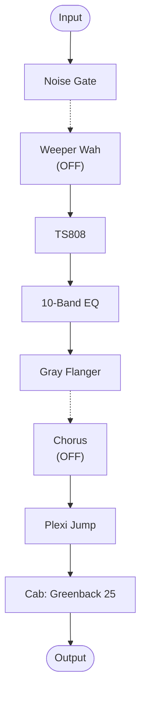
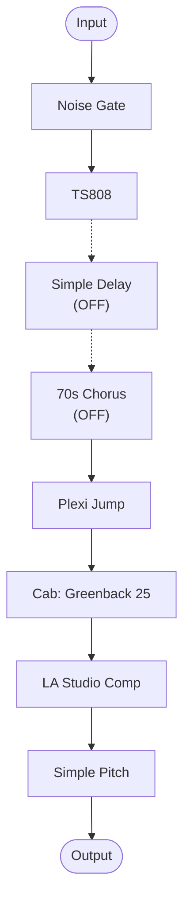

# Randy Tribute — signal flow

Mermaid diagrams of the two DSP paths in `Randy_Tribute.hlx`, generated by
reading `@position`/`@enabled` on each block. Dashed lines mark a block
that's bypassed (OFF) but still routed inline, passing signal through
unaffected.

**Status:** neither path actually splits into parallel A/B branches here —
the `split`/`join` structural blocks are present but only one lane has
blocks, so both diagrams are simple linear chains. Most block models in
this preset (Plexi amp, LA Studio Comp, cab) are ✅ confirmed in
`glossary/models.md`.

## Path 1 (dsp0)

## Path 2 (dsp1)

