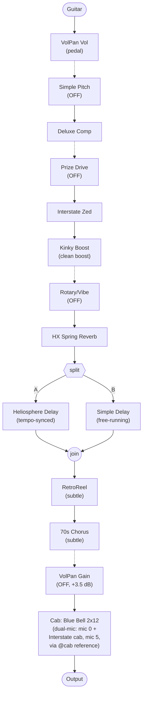

# country stuff di — signal flow

## Why this tone works — clean country twang

*Blends confirmed parameter values with general knowledge of these
amp/pedal models and genre conventions; treat the interpretive claims as
informed reading, not confirmed fact.*

This one's built around a completely different goal than either of the
other two presets in this catalog: stay clean, stay dynamic, stay bright
enough to cut through a mix on single-note lines. The `di` in the filename
is a clue too — this reads like a tone meant to go straight into a mixer
or interface, not necessarily through a cranked stage amp.

- **Compressor right up front, fast attack, fully wet** —
  `HD2_CompressorDeluxeComp` at `Attack: 0.038`, `Mix: 1`,
  `Threshold: -37.1`. That's a lot of compression engaging on almost
  everything you play. This is the classic "country comp": it evens out
  pick attack so fast single-note runs and chicken-pickin' land at a
  consistent volume instead of the first note jumping out ahead of the
  rest.
- **Amp voiced bright and mostly clean** — `HD2_AmpInterstateZed` at
  `Drive: 0.15`, `Treble: 0.8`, `Presence: 0.69`, decent `Sag: 0.75`. Low
  gain, lots of top end — headroom and articulation over saturation,
  which is what lets picking dynamics (helped along by that compressor)
  actually come through instead of getting smeared by amp breakup.
  "Zed" in the name likely nods to Dr. Z Amplification, a boutique brand
  that shows up a lot in modern session and country rigs for exactly this
  kind of clean headroom.
- **A drive pedal used purely as a clean boost, not a distortion** —
  `HD2_DistKinkyBoost` at `Drive: 0`, `Boost: True`. Zero drive, boost
  stage engaged — this isn't there to add grit, it's there to nudge the
  amp a little harder for a solo or a louder section without changing the
  clean character.
- **A second drive pedal (`HD2_DistPrizeDrive`) and the rotary/vibe
  effect are both off by default** — available, not engaged. That's
  consistent with a preset built for snapshot-switching: keep the base
  tone clean and compressed, and pull in more character (a boosted lead
  sound, a Leslie-style swirl) only when a snapshot calls for it.
- **Ambience kept light and layered, not washy** — a subtle spring
  reverb (`HD2_ReverbHxSpring`, `Mix: 0.12`) plus two parallel delays
  blended together: a tempo-synced `HD2_DelayHeliosphere` (which has its
  own small reverb baked into the tail) and a free-running
  `HD2_DelaySimpleDelay` at a longer, non-synced time. Layering a
  rhythmic delay with a longer, looser one is a common trick for adding
  depth without the single, obvious slap-back-echo repeat you'd get from
  either alone.
- **A whisper of tape and chorus, not a wash of either** —
  `HD2_RetroReel` (tape saturation/character) and `HD2_Chorus70sChorus`
  are both present but barely engaged (`Texture: 0.1`, chorus
  `Mix: 0.1`, `ChorusIntensity: 0`). Just enough to take the edge off a
  perfectly digital-clean signal, not enough to actually sound modulated
  or lo-fi.
- **One cab, two mics blended** — the Blue Bell 2x12 cab block
  (`HD2_CabMicIr_2x12BlueBellWithPan`) references a second mic/cab
  configuration (an "Interstate" 2x12, different mic choice, panned hard
  right vs. the first mic's center) via its `@cab` field. Dual-mic'ing one
  cab like this is a standard studio trick for a wider, more
  three-dimensional cab image than a single mic'd cab gives you.

### Guitar & pickups

Passive single-coils, especially a Telecaster bridge pickup, are the
textbook pairing here — country twang basically *is* a Tele bridge
pickup sound, and this preset's bright, clean, dynamic voicing is built
to let that character through untouched.

If you're on actives, as most of what you own is: this is the preset
where that matters most so far. Actives will flatten out some of the
picking-dynamics articulation this tone (and its front-loaded compressor)
is built around, and they won't have the airy top-end snap a Tele
single-coil gives you — expect a smoother, less "quacky" result. It's not
a lost cause: the compressor is already doing a lot of the evening-out
work regardless of pickup type, so the tone will still read as clean and
controlled. You'll just be trading some of the twangy edge for a rounder,
more even character — closer to a humbucker-neck country-jazz tone than
classic Tele twang.

## Signal flow

Generated by reading `@position`/`@path`/`@enabled` on each block, plus a
new `unpositioned_blocks` pass in `scripts/parse_hlx.py` that catches
blocks like `cab0` that have no `@position` at all (previously silently
dropped). Dashed lines mark a block that's bypassed (OFF) but still
routed inline, passing signal through unaffected.

**Status:** confirmed against the HX Edit signal chain view, viewed on the
"Lead" snapshot (UI slot 4, JSON key `snapshot3` — see the note on
0-indexing in the Snapshots section below). Block order, the parallel
delay split, and the single visible Cab block all match. One correction
from that check: `cab0` is not a second parallel cab — `block5` (the
Blue Bell cab) carries `"@cab": "cab0"`, a direct reference to that key,
confirming it's the *second mic* of that one cab block's dual-mic blend,
not an independent signal path. HX Edit's chain view shows exactly one
Cab icon here, which matches. `@topology0: "A"` / `@topology1: "SABJ"`
and the `@input` pattern (Path 1 → Path 2 series) both hold up too.

Two things this diagram can't show accurately: bypass state reflects each
block's base `@enabled` value, which matches this preset's "Clean-ish"
snapshot (JSON key `snapshot0`) — not the "Lead" snapshot shown in the
reference screenshot, since bypass can be (and here, is) overridden per
snapshot. See Snapshots below for what actually changes between them.
And the `[bracketed]` block names visible in HX Edit's chain view remain
unexplained — see the open question in `glossary/models.md`.

## Snapshots

This preset uses 4 of its 8 snapshot slots; the other 4 (`snapshot4`–
`snapshot7` in the JSON, UI slots 5–8) are untouched defaults — all
blocks enabled, generic names (`"SNAPSHOT 5"` etc.) — and not part of the
working preset.

*Indexing note: HX Edit numbers snapshots 1–8 in the UI; the JSON stores
them 0-indexed as `snapshot0`–`snapshot7`. UI slot N is JSON key
`snapshotN-1`. Easy to get this off by one — "Lead" is UI slot 4 but JSON
key `snapshot3`.*

The 4 used snapshots read as a straightforward gain-staging progression
for a live set — clean rhythm, into a light break, into a driven rhythm,
into a boosted lead:

| Block | Clean-ish | Half-Drive | Drive | Lead |
|---|---|---|---|---|
| Deluxe Comp (dsp0) | **on** | off | off | off |
| Prize Drive (dsp0) | off | **on**, `Drive: 0.10` | **on**, `Drive: 0.20` | **on**, `Drive: 0.30` |
| Interstate Zed amp `Drive` | `0.15` | `0.20` | `0.25` | `0.25` |
| VolPan Gain (dsp1, `+3.5 dB`) | off | off | off | **on** |

Everything else stays constant across all four: the volume pedal, Simple
Pitch (off throughout — available, unused), the reverb/delay/tape/chorus
ambience chain, the cab, and Rotary/Vibe (also off throughout — present
in the chain but apparently not used anywhere in this preset's snapshot
bank).

Reading the table as a story: `Clean-ish` uses the Deluxe Comp instead of
any drive to keep things controlled while fully clean. Once the Prize
Drive engages for `Half-Drive`, the Comp switches off — once there's
pedal-driven grit and the amp's own dynamics doing the work, a separate
compressor evening things out is arguably redundant or even fighting the
picking dynamics. From there, `Drive` and `Lead` are the same pedal
getting pushed harder (`Drive` param climbing `0.10 → 0.20 → 0.30`)
alongside the amp's own gain (`0.15 → 0.20 → 0.25`, plateauing at `Drive`).
`Lead` adds one more thing on top: a dedicated `+3.5 dB` level boost via
the otherwise-unused `VolPan Gain` block, so a solo actually sits louder
in the mix, not just more driven.
